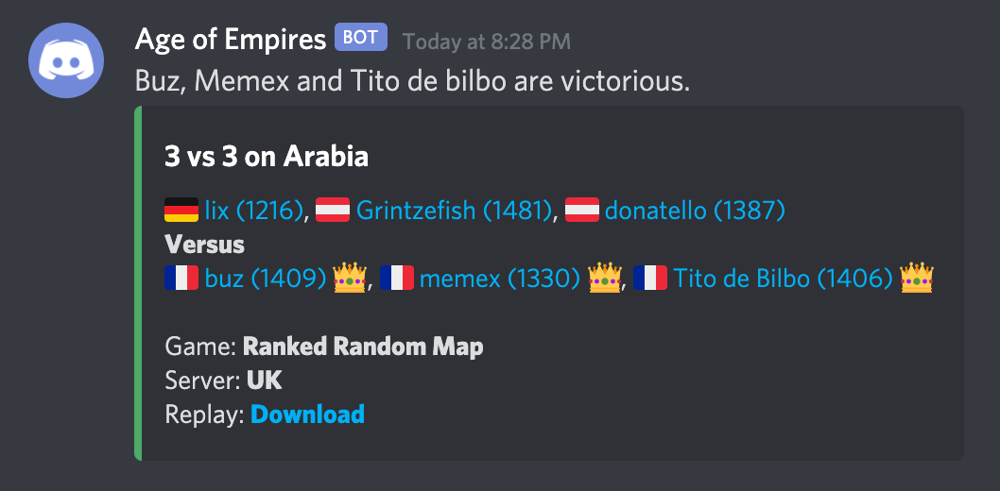

# Age of Empires Match Notifier

A Discord bot to notify the match results of your [Age of Empires 2: Definitive Edition](https://www.ageofempires.com/) community.

### Introduction

The goal of this project is to keep your community informed about your successes (and defeats) in Age of Empires 2 Definitive Edition by sending the results of your matches through Discord notifications.

Example:



> The bot collects game data from World's Edge public API.

### Requirements

Software:
- [python](https://www.python.org/downloads/release/python-370/) 3.7 or higher.

### Install on Ubuntu Focal

1. Update the package lists:
```
$ apt update
```

2. Install pip:
```
$ apt install -y python3-pip
```

3. Install the project dependencies:
```
$ pip3 install requests pyyaml
```

4. Create the installation directory:
```
$ mkdir /etc/aoe
```

5. Put the sources inside:
```
$ ls -1 /etc/aoe/
aoe.py
main.py
```

### Usage

1. Edit the configuration file by filling your friends's Steam IDs and your Discord webhook:
```
$ cat /etc/aoe/config.yml
worldsedge_url: "https://aoe-api.worldsedgelink.com/community"
discord_hook: "https://discord.com/api/webhooks/your/token"
players:
- name: "TheViper"
  steamId: "76561197984749679"
  profileId: 196240
- name: "Hera"
  steamId: "76561198449406083"
  profileId: 199325
```

2. Start the service:
```
$ python3.8 /etc/aoe/main.py --config-file="/etc/aoe/config.yml"
```

### As daemon

1. Set un unit systemd daemon:
```
$ cat /etc/systemd/system/aoe.service
[Unit]
Description=aoe-notifier
Wants=network-online.target
After=network-online.target

[Service]
Type=simple
ExecStart=python3 /etc/aoe/main.py --config-file="/etc/aoe/config.yml"
Restart=always
RestartSec=10

[Install]
WantedBy=multi-user.target
```

2. Enable the service
```
$ systemctl daemon-reload
$ systemctl start aoe.service
```

3. Check the logs
```
$ journalctl -u aoe.service -f
```
